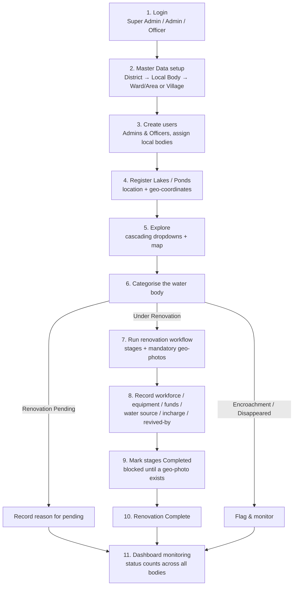

# Lake Management System 💧

A full-stack web application to **monitor, revive and protect lakes & ponds**
across a district's local bodies — with role-based access, a cascading
geographic explorer, map-based tracking, and a stage-by-stage renovation
workflow that **requires geo-tagged photos at every stage**.

- **Backend:** Django 5 + Django REST Framework + JWT auth (SQLite)
- **Frontend:** React (Create React App) + React Router + Leaflet maps
- **Theme:** professional two-colour palette — deep navy + teal

---

## Roles & authorization

| Role | Capabilities |
|------|--------------|
| **Super Admin** | Full access. Manages Admins, Officers and all master data. |
| **Admin** | Manages Officers and master/geography data within their district. |
| **Officer** | Field user. Updates lakes/ponds and the renovation workflow for their **assigned local bodies** only. |

Auth is JWT-based (`/api/auth/login/`, `/api/auth/refresh/`). The token carries
the role; the React app gates routes and actions by role.

**Demo logins** (password `admin123`): `superadmin`, `admin`, `officer`.

---

## Application workflow (end to end)

The system follows one continuous flow: **set up the area → register the water
bodies → find them on the map → categorise them → run the renovation, stage by
stage, with proof photos → record who/what/how-much → monitor on the
dashboard.** The diagram below shows the whole lifecycle; each numbered step is
explained underneath.



### Step 1 — Login & role routing
A user signs in at `/login`. The JWT carries the role, and the React app shows
only the menus that role is allowed to use (Officers do **not** see *Master
Data* or *Users*).

### Step 2 — Set up master data *(Super Admin / Admin)*
Before any lake can be added, the area hierarchy must exist. Under **Master
Data**, enter — **in this order** — so each dropdown has parents to hang off:

1. **District**
2. **Local Body** — pick a type (Corporation / Municipality / Town Panchayat /
   Panchayat) and name it. A district can have many of each.
3. **Wards & Areas** — for Corporation / Municipality / Town Panchayat: add
   Wards, then click a Ward to add its Areas.
4. **Villages** — for Panchayats only.

### Step 3 — Create users & assign scope *(Super Admin / Admin)*
Under **Users**, create Admins (Super Admin only) and Officers. An Officer is
tied to a **district** and a set of **local bodies** — they can only edit water
bodies inside those bodies, though they can read everything.

### Step 4 — Register lakes & ponds *(Super Admin / Admin)*
Under **Master Data → Lakes & Ponds**, walk the cascade to a location, then add
the water body with its name, type (lake/pond), **latitude/longitude** (used for
the map marker), initial status, and water source.

### Step 5 — Explore *(all roles)*
On **Explore Lakes & Ponds**, the user drills down:

```
District → Local Body Type → Local Body → Ward → Area      (Corp / Muni / Town Panchayat)
District → Local Body Type → Local Body → Village          (Panchayat)
```

At the deepest selected level the matching lakes/ponds are listed beside a live
**Leaflet map**; clicking a row or a map marker opens that water body. The
**Map View** page plots every body for a chosen local body.

### Step 6 — Categorise the water body
On the body's **Overview** tab it is set to one of:
`Under Renovation`, `Renovation Complete`, `Renovation Pending`,
`Encroachment`, `Disappeared`. Choosing **Renovation Pending** requires a
typed reason.

### Step 7 — Run the renovation workflow *(Officer / Admin)*
On the **Renovation Workflow** tab, work is tracked as ordered **stages**
(e.g. Survey → De-silting → Bund strengthening → Inlet/Outlet work). For each
stage the officer sets a status and uploads **geo-tagged photos** — every photo
carries latitude/longitude (the *“Use my location”* button fills it from the
browser). A stage that is *Pending* must carry a reason.

### Step 8 — Record the supporting details
Still on the water body, the officer fills the other tabs:

- **Workforce** — people who worked, counted **separately by gender** with
  designation.
- **Equipment** — machines/equipment used and quantities.
- **Funds** — money spent (each entry rolls up into the body's total).
- **Overview** — water source (rain only / river / both), capacity, area,
  **incharge** and contact, and **revived by** (NGO / Local Team / Government).

### Step 9 — Complete stages (the hard rule)
A stage **cannot be marked *Completed* until at least one geo-tagged photo has
been uploaded for it** — enforced on both the React form and the Django API.
This guarantees photographic, located proof for every finished stage.

### Step 10 — Renovation complete
Once all stages are done, the body is moved to **Renovation Complete**.

### Step 11 — Monitor on the dashboard
The **Dashboard** shows live counts per category across all water bodies;
clicking a category jumps straight to the filtered explorer.

---

## Geographic hierarchy (cascading dropdowns)

```
District
└── Local Body  (4 types)
    ├── Corporation     (Maanagaratchi) ─┐
    ├── Municipality    (Nagaratchi)     ├─►  Ward ──► Area ──► Lakes / Ponds
    ├── Town Panchayat  (Peruratchi)    ─┘
    └── Panchayat       (Ooratchi)       ────────────► Village ──► Lakes / Ponds
```

The **Explore Lakes & Ponds** page walks the user through
District → Local Body Type → Local Body → Ward → Area (or → Village for
Panchayats) and then lists the water bodies, with a live **Leaflet map**
beside the list. Each local body / water body has its own map view.

Master data (districts, local bodies, wards, areas, villages, lakes/ponds) is
entered under **Master Data** (Admin / Super Admin only).

---

## Lake / Pond tracking

Each water body is categorised as one of:
`Under Renovation`, `Renovation Complete`, `Renovation Pending`,
`Encroachment`, `Disappeared`.

For every water body the system records:

- **Renovation workflow** — ordered stages, each with a status and
  **mandatory geo-tagged photo uploads**. A stage cannot be marked *Completed*
  until at least one photo with latitude/longitude is uploaded. Pending stages
  require a reason.
- **Workforce** — counted separately by **gender** with designation.
- **Machines & equipment** used.
- **Funds** used (auto-rolled-up total).
- **Water source** — rain water only / river connection / both.
- **Incharge** officer and contact.
- **Revived by** — NGO / Local Team / Government (with name).
- **Capacity** and area.

---

## Running locally

### 1. Backend

```bash
python3 -m venv venv
source venv/bin/activate
pip install -r backend/requirements.txt
cd backend
python manage.py migrate
python manage.py seed_demo      # demo users + sample data
python manage.py runserver      # http://localhost:8000
```

Django admin: http://localhost:8000/admin (`superadmin` / `admin123`).

### 2. Frontend

```bash
cd frontend
npm install
npm start                       # http://localhost:3000
```

### Or both at once

```bash
./run.sh
```

---

## Project layout

```
backend/
  config/          Django project (settings, urls)
  accounts/        Custom User + roles, JWT login, permissions
  geography/       District, LocalBody, Ward, Village, Area
  lakes/           WaterBody (lake/pond) + status, water source, incharge
  renovation/      RenovationStage, StagePhoto, Worker, Equipment, FundEntry
frontend/
  src/api/         Axios client with JWT refresh interceptor
  src/auth/        Auth context
  src/components/  Layout, maps, status badge, stage workflow
  src/pages/       Login, Dashboard, Explorer, MapView, WaterBodyDetail,
                   Masters, Users
```

## Key API endpoints

| Endpoint | Purpose |
|----------|---------|
| `POST /api/auth/login/` | JWT login (returns user + tokens) |
| `GET /api/districts/` `…/local-bodies/?district=` `…/wards/?local_body=` `…/areas/?ward=` `…/villages/?local_body=` | Cascading geography |
| `GET /api/water-bodies/?area=&ward=&village=&local_body=&status=` | List lakes/ponds |
| `GET /api/water-bodies/stats/` | Status counts for the dashboard |
| `…/stages/` `…/stage-photos/` | Renovation workflow + geo-photos |
| `…/workers/` `…/equipment/` `…/fund-entries/` | Workforce, machinery, funds |
| `…/users/` | User management (Admin / Super Admin) |
